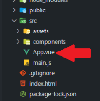

# Estructura de un proyecto Vue.js

Al momento de crear un proyecto en Vue.js, se generan varios archivos, cada uno con su utilidad en Vue.js. Estos archivos incluyen los siguientes:

<center>


</center>

**Donde:**

**introduction-to-vue:** Este es el nombre del proyecto creado usando el comando **"npm create vue@latest"**, es decir, el archivo anterior es una explicación de este proyecto.

**README.md:** Este archivo es para proporcionar información esencial y relevante sobre el proyecto, permitiendo a los usuarios y desarrolladores entender rápidamente de qué se trata el proyecto y cómo utilizarlo.

**vite.config.js:** Es un archivo de configuración que te permite personalizar el comportamiento del entorno de desarrollo y construcción de tu aplicación Vite.

**package.json:** Es un archivo de configuración utilizado en proyectos de Node.js y npm. Este archivo es fundamental en cualquier proyecto basado en Node.js, ya que contiene información sobre el proyecto y sus dependencias, scripts de ejecución, configuraciones, y más.

**package-lock.json:** Es un archivo generado automáticamente por npm cuando se instalan las dependencias de un proyecto Node.js, se utiliza para almacenar información detallada sobre las versiones exactas de cada módulo y sus dependencias, incluyendo las versiones específicas de cada paquete, así como los hashes de los archivos descargados.

**node_modules:** Es un directorio en un proyecto Node.js que contiene las dependencias del proyecto. Cuando trabajas en un proyecto Node.js y utilizas herramientas como npm (Node Package Manager) o yarn para gestionar las dependencias del proyecto, estas herramientas descargan e instalan las bibliotecas y paquetes necesarios en el directorio node_modules.

**.gitignore:** Es un archivo especial en un repositorio de Git que le indica a Git qué archivos y carpetas debe ignorar al realizar seguimiento de cambios.

```js
node_modules/
npm-debug.log
.env
```

**index.html:** Es el punto de entrada principal de la aplicación web. Dentro del archivo index.html, hay una etiqueta < div> con un atributo id específico, por lo general id="app". Esta etiqueta < div> sirve como el punto de montaje para la aplicación Vue.js.

```html
<!DOCTYPE html>
<html lang="en">
    <head>
        <meta charset="utf-8">
        <meta http-equiv="X-UA-Compatible" content="IE=edge">
        <meta name="viewport" content="width=device-width, initial-scale=1">
        <title>Vue.js App</title>
    </head>
    <body>
        <!-- Punto de montaje de la app de Vue.js -->
        <div id="app"></div>
    </body>
</html>
```

**public:** El directorio public en proyectos de desarrollo web generalmente contiene archivos estáticos que se servirán directamente al cliente sin necesidad de ser procesados o compilados. Estos archivos están disponibles públicamente para los usuarios de la aplicación y pueden ser accedidos directamente a través de URLs.

```js
project-folder/
  ├── public/
  │   ├── index.html
  │   ├── styles/
  │   │   └── main.css
  │   ├── images/
  │   │   └── logo.png
  │   └── ...
  ├── src/
  │   ├── ...
```

**src:** Es una abreviatura comúnmente utilizada para referirse al directorio "source". En proyectos de programación, el directorio src suele ser el lugar donde se almacenan los archivos de código fuente del programa.

```js
project-folder/
  ├── src/
  │   ├── components/
  │   │   ├── TheHeader.vue
  │   │   ├── TheSidebar.vue
  │   │   └── ...
  │   ├── styles/
  │   │   ├── main.css
  │   │   ├── variables.scss
  │   │   └── ...
  │   ├── main.js
  │   └── ...
  └── ...
```

**src/assets:** Se utiliza para almacenar archivos estáticos y recursos multimedia que son utilizados por la aplicación, como imágenes, iconos, fuentes, archivos de audio, archivos JSON u otros archivos que no requieren procesamiento especial por parte del sistema de construcción.

```js
src/
  ├── assets/
  │   ├── images/
  │   │   ├── logo.png
  │   │   ├── banner.jpg
  │   │   └── ...
  │   ├── icons/
  │   │   ├── icon1.svg
  │   │   ├── icon2.png
  │   │   └── ...
  │   ├── fonts/
  │   │   ├── font1.woff
  │   │   ├── font2.ttf
  │   │   └── ...
  └── ...
```

**src/components:** Se utiliza para almacenar los componentes reutilizables de la aplicación. Los componentes son bloques de construcción fundamentales de la interfaz de usuario y representan partes específicas y autónomas de una página web o aplicación.

```js
    src/
    ├── components/
    │   ├── TheHeader.vue
    │   ├── TheSidebar.vue
    │   ├── TheButton.vue
    │   ├── TheModal.vue
    │   └── ...
    └── ...
```

**main.js:**  Es el archivo donde se inicializa la instancia principal de Vue y se monta en el DOM, lo que permite que la aplicación Vue funcione.

**App.vue:** Es un componente principal en proyectos Vue.js. Vue.js utiliza un enfoque de desarrollo basado en componentes, donde la interfaz de usuario se construye mediante la composición de varios componentes reutilizables. App.vue es el componente principal que sirve como contenedor para toda la aplicación.

**Nota:** Para explicar los fundamentos de Vue.js, se utilizará únicamente el componente principal, es decir, "App.vue":

<center>



</center>