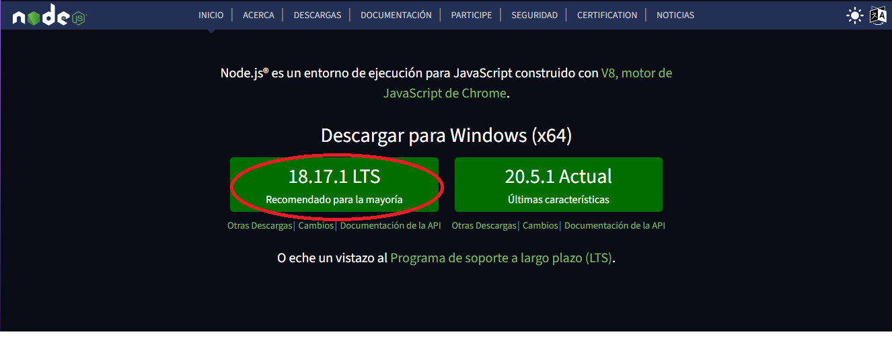
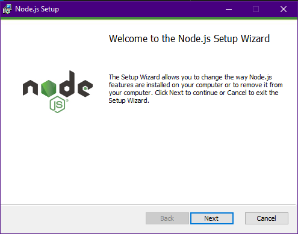

# Instalación de Node.js en Windows

Para instalar Node.js, debemos dirigirnos a su página oficial: [Ir a la página oficial de Node.js](https://nodejs.org/es)

Al ingresar en la página, lo primero que se debe hacer es presionar el botón de color verde con la versión de node seguido de la palabra **"Recomendado para la mayoría"**, en este caso: **18.17.1 LTS Recomendado para la mayoría**



Después de descargar node, debemos ejecutar el instalador:



Luego aparecerá una ventana donde tendremos que aceptar los términos y condiciones y luego **"siguiente"** y **"siguiente"** hasta finalizar, luego de que halla finalizado la instalación, se debe comprobar que se haya realizado correctamente. Para ello, se debe abrir una terminal y escribir los siguientes comandos:

```cmd
"Comando de consola"> node -v

"Salida"
v18.17.1

"Comando de consola"> npm -v

"Salida"
9.6.7
```

# Instalación de Node.js en Linux basados en Debian

Si se está utilizando un sistema operativo Linux, específicamente en distribuciones basadas en Debian como Ubuntu, se debe de siguir los siguientes pasos para instalar Node.js utilizando el gestor de paquetes apt:

* Actualizar el Índice del Paquete para asegurar que se esté trabajando con la información de paquetes más reciente:

```cmd
"Comando de consola"> sudo apt update
```

* Para instalar Node.js.

```cmd
"Comando de consola"> sudo apt install nodejs
```

# Verificar la Instalación:

Para asegurarte de que Node.js se ha instalado correctamente, al igual que en Windows ejecutan los siguientes comandos en la terminal, de manera similar a como lo harías en Windows:

```cmd
"Comando de consola"> node -v

"Salida"
v18.17.1
```

Cuando instalas Node.js, también se instalará su gestor de paquetes, npm (Node Package Manager). Para verificar la versión de npm instalada en tu sistema:

```cmd
"Comando de consola"> npm -v

"Salida"
9.6.7
```