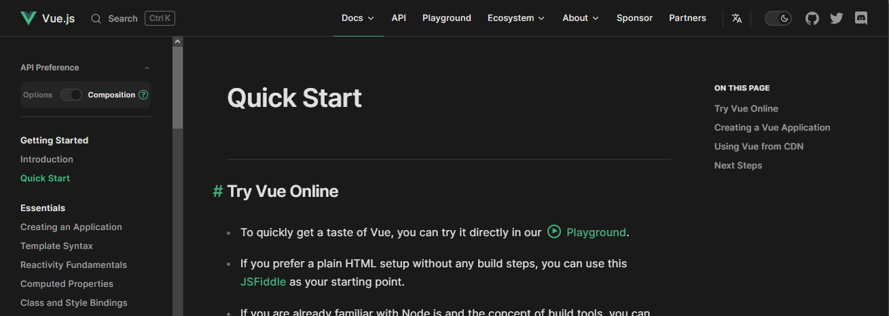

# Instalación de Vue.js

Para instalar Vue.js, los usuarios pueden seguir la guía detallada disponible en la página oficial de Vue.js. Para acceder a la guía completa, haz clic en el siguiente enlace: [Guía de instalación de Vue.js](https://vuejs.org/guide/quick-start.html)

Al acceder a la página, el usuario se encontrará con la siguiente pantalla:



Un punto a considerar es que, a diferencia de Node.js, Vue.js debe instalarse mediante comandos en la terminal utilizando el gestor de paquetes de Node.js. Por lo tanto, es necesario tener Node.js instalado previamente. Para llevar a cabo la instalación, el usuario debe ejecutar el siguiente comando:

```cmd
"Comando de consola"> npm create vue@latest

"Salida"

✔ Project name: … "Nombre del Proyecto"
✔ Add TypeScript? … No / Yes
✔ Add JSX Support? … No / Yes
✔ Add Vue Router for Single Page Application development? … No / Yes
✔ Add Pinia for state management? … No / Yes
✔ Add Vitest for Unit testing? … No / Yes
✔ Add an End-to-End Testing Solution? … No / Cypress / Playwright
✔ Add ESLint for code quality? … No / Yes
✔ Add Prettier for code formatting? … No / Yes

Scaffolding project in ./"Nombre del Proyecto"...
Done.
```

Cada una de las opciones tiene una función importante, que se detalla a continuación:

* **Project name:** Permite al usuario definir un nombre único para el proyecto Vue.js.
* **Add TypeScript?:** Ofrece la opción de agregar soporte para TypeScript, un superset de JavaScript que añade tipado estático al lenguaje.
* **Add JSX Support?:** Pregunta si desea añadir soporte para JSX, una extensión de sintaxis para JavaScript comúnmente utilizada con bibliotecas como React.js.
* **Add Vue Router for Single Page Application development?:** Consulta si desea integrar Vue Router, el enrutador oficial para aplicaciones Vue.js de una sola página (SPA).
* **Add Pinia for state management?:** Ofrece la opción de agregar Pinia, una biblioteca de gestión del estado para Vue.js, similar a Vuex pero con una sintaxis más moderna y reactiva.
* **Add Vitest for Unit testing?:** Permite agregar Vitest, un marco de pruebas unitarias diseñado específicamente para aplicaciones Vue.js.
* **Add an End-to-End Testing Solution?:** Consulta si desea agregar una solución de pruebas de extremo a extremo. El usuario puede elegir entre "No", "Cypress" o "Playwright", dos herramientas populares para pruebas automatizadas de extremo a extremo en aplicaciones web.
* **Add ESLint for code quality?:** Ofrece la opción de agregar ESLint, una herramienta de linting que ayuda a mantener la calidad del código identificando y corrigiendo problemas en el código JavaScript.
* **Add Prettier for code formatting?:** Consulta si desea añadir Prettier, una herramienta de formateo de código que mantiene un estilo de código consistente y legible.


Después de completar el proceso anterior, es necesario acceder a la carpeta creada mediante el comando anterior a través de la consola:

```cmd
"Comando de consola"> cd "Nombre del proyecto"
```

Dentro de la carpeta, es necesario instalar todos los paquetes necesarios para el funcionamiento de Vue.js y sus dependencias mediante el siguiente comando:

```cmd
"Nombre del proyecto"> npm install
```

Después de completar la instalación de los paquetes, se puede ejecutar el proyecto mediante el siguiente comando:

```cmd
"Nombre del proyecto"> npm run dev
```