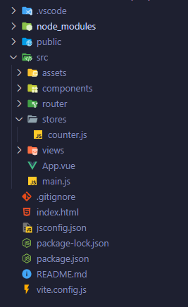

# Estructura de un proyecto con Pinia

En el apartado de dependencias de desarrollo es donde observaremos la inclusión de Pinia en el proyecto por primera vez:

```json
"dependencies": {
    "pinia": "^2.1.7",
    "vue": "^3.3.11",
    "vue-router": "^4.2.5"
},
```

Después de examinar el archivo **package.json**, podremos notar al abrir la carpeta **src** que se han generado otras carpetas: **stores**, tal como se muestra en la siguiente imagen:



* **La carpeta stores:** Se utiliza para almacenar los archivos relacionados con la gestión del estado de la aplicación. En ella se guardan los stores o almacenes, que son módulos que contienen el estado de la aplicación, sus mutaciones y acciones asociadas.

  Los stores en Pinia son contenedores reactivos donde se almacenan los datos de la aplicación. Al dividir la lógica del estado en estos stores, se logra una mejor modularidad, lo que facilita el mantenimiento y la reutilización del código.


Otro punto importante a tener en cuenta es que el archivo **main.js** tiene ciertos cambios:

* **main.js** sin Pinia:

```javascript
import './assets/main.css'

import { createApp } from 'vue'
import App from './App.vue'

createApp(App).mount('#app')
```

* **main.js** con Pinia:
```javascript
import './assets/main.css'

import { createApp } from 'vue'
import { createPinia } from 'pinia'

import App from './App.vue'

const app = createApp(App)

app.use(createPinia())

app.mount('#app')
```

El archivo se configura automáticamente para habilitar el uso de Pinia en la aplicación. Al igual que con Vue Router, se monta directamente el componente principal y se inicia una instancia de este componente. Esto permite que Pinia sea leído por Vue.js a través del método **app.use()**. Este enfoque permite una configuración inicial adecuada de Pinia dentro de la aplicación.
