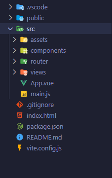

# Estructura de un proyecto con Vue Router

En el apartado de dependencias de desarrollo es donde observaremos la inclusión de Vue Router en el proyecto por primera vez:

```json
"dependencies": {
    "vue": "^3.3.4",
    "vue-router": "^4.2.5"
},
```

Después de examinar el archivo **package.json**, podremos notar al abrir la carpeta **src** que se han generado otras carpetas: **router** y **views**, tal como se muestra en la siguiente imagen:



* **La carpeta router:** Generalmente almacena archivos relacionados con Vue Router. Aquí es donde comúnmente se configuran las rutas de la aplicación Vue.js.
* **La carpeta views:** Suele contener los componentes de vistas (views) de la aplicación. Estos componentes suelen representar las páginas o vistas individuales de la aplicación y se utilizan para organizar y estructurar el contenido que se mostrará al usuario.

Otro punto importante a tener en cuenta es que el archivo **main.js** tiene ciertos cambios:

* **main.js** sin Vue Router:
```javascript
import './assets/main.css'

import { createApp } from 'vue'
import App from './App.vue'

createApp(App).mount('#app')
```

* **main.js** con Vue Router:
```javascript
import './assets/main.css'

import { createApp } from 'vue'
import App from './App.vue'
import router from './router'

const app = createApp(App)

app.use(router)

app.mount('#app')
```

El archivo se configura automáticamente para habilitar el uso de Vue Router en la aplicación. En lugar de montar directamente el componente principal, se inicia una instancia de este componente primero. Esto permite enviar las rutas al constructor de la aplicación Vue y, posteriormente, montar el componente con las rutas recibidas a través del método **app.use()**. Este enfoque permite una configuración inicial adecuada de Vue Router dentro de la aplicación.
